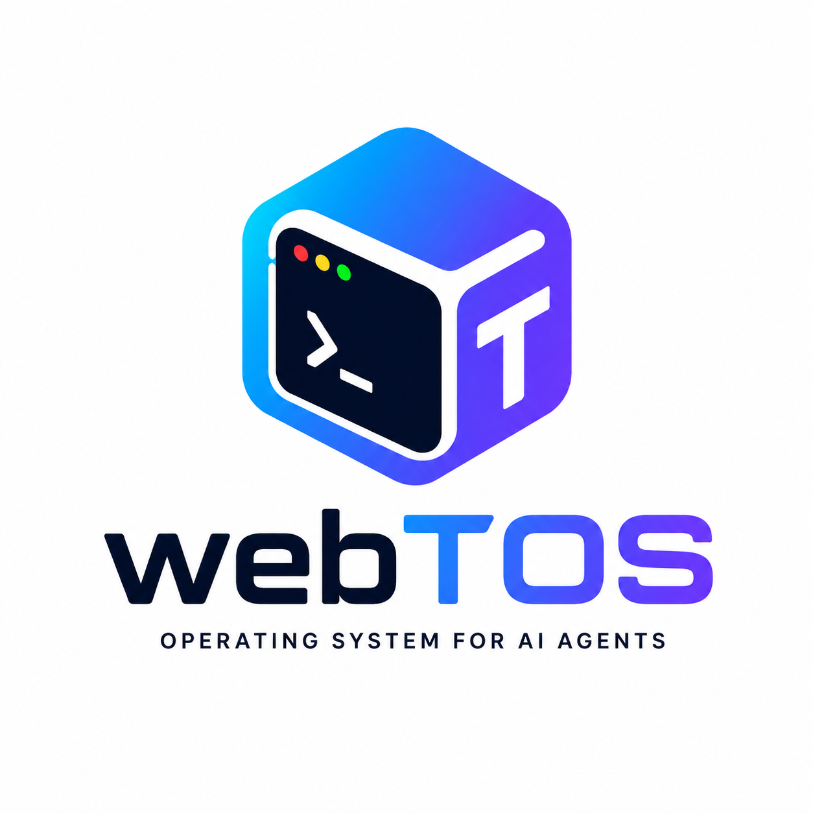
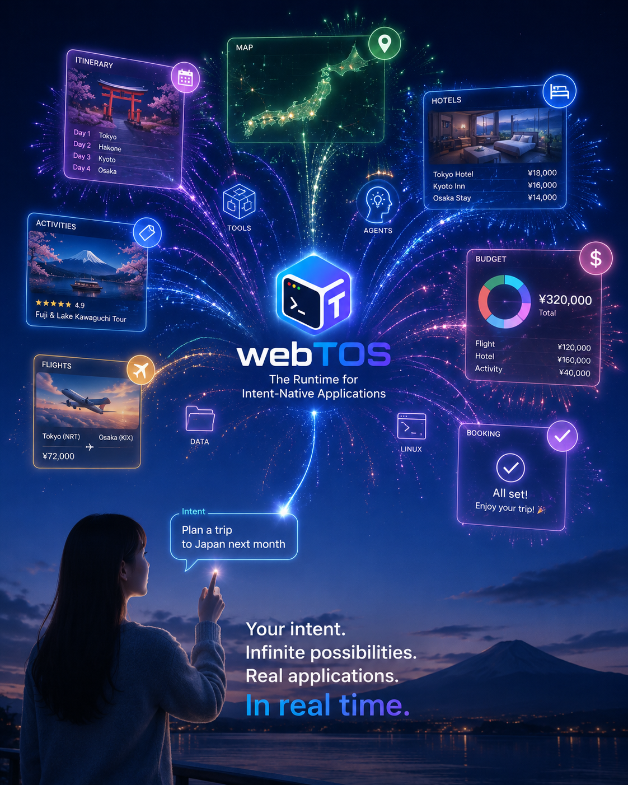

<p align="center">
  
</p>

<p align="center">
  <strong>The Runtime for Intent-Native Applications.</strong><br>
  Turn user intent into dynamically composed applications, backed by real Linux software running locally in the browser.
</p>

<p align="center">
  <a href="#overview">Overview</a> &middot;
  <a href="#intent-native-applications">Intent-Native Apps</a> &middot;
  <a href="#architecture">Architecture</a> &middot;
  <a href="#project-status">Status</a> &middot;
  <a href="ROADMAP.md">Roadmap</a> &middot;
  <a href="#running-natively">Development</a> &middot;
  <a href="LICENSE">MIT License</a>
</p>

## Overview

The Web was built around applications whose interfaces and workflows are
mostly decided before the user arrives. The agentic Web changes that model.
A user can express an intent; an agent can understand the goal, choose tools,
inspect data, run software, and adapt the workflow as results arrive. The
application itself can become part of that plan.

**webTOS is the runtime foundation for that world.** Its long-term direction is
to support **intent-native applications**: applications whose interface,
agents, tools, data, local processes, state, permissions, and approval points
can be composed dynamically for the user's current objective.

The foundation is concrete today: webTOS runs **unmodified Linux x86-64
binaries inside a browser tab**. Not a port, not a reimplementation in
JavaScript, and not a container on someone else's machine: the same ELF that
runs on a Linux host executes in the page.

It is a WebAssembly x86-64 execution engine with the operating-system half of
the Linux ABI on top of it — processes, threads, signals, a virtual
filesystem, sockets, and pseudoterminals — plus a browser host that supplies
storage, a terminal, and a network path.

The browser is the deployment environment, not the execution model. webTOS
owns its own scheduler, guest memory, process state, and filesystem rather
than exposing ambient browser authority to what it runs: a guest reaches the
network only through a relay the page configured, and a deployment can bound
its memory, CPU, storage, and network use with runtime-enforced budgets.

The short version:

> **Intent in. Application out.**
>
> The interface may be generated for the task. The tools behind it are real.
> The execution stays local and bounded in the browser.

### Current goal and future direction

The current engineering goal is to run unmodified Linux x86-64 AI agent
software locally in the browser. Development is gated by real workloads rather
than raw instruction or syscall counts:

```text
static hello
    -> static BusyBox
    -> dynamic Linux ELF
    -> threads and event-driven networking
    -> OpenFox
    -> Codex and Claude Code
```

This is not separate from the intent-native vision; it is the execution
foundation required to make it useful. Dynamic UI alone can generate a button
labelled `Run tests`. A real intent-native application also needs the
repository, `git`, the test runner, subprocesses, a terminal, persistence,
network policy, and resource limits behind that button.

The proposed application-composition layer is described in
[`docs/INTENT_NATIVE_APPLICATIONS.md`](docs/INTENT_NATIVE_APPLICATIONS.md).
Application Graphs, dynamic UI composition APIs, and public SDK surfaces in
that document are product direction, not claims of shipped functionality.
See the [webTOS Roadmap](ROADMAP.md) for current architecture boundaries,
milestone exit criteria, risks, and the product definition of done.

## Intent-Native Applications

A traditional Web application is largely application-first:

```text
Developer
   |
   v
Routes + UI + APIs + workflows
   |
   v
Deployed application
   |
   v
User chooses a predefined path
```

An intent-native application can invert that relationship:

```text
User Intent
     |
     v
Agent understands and plans
     |
     v
Application Graph
     |
     +-- UI
     +-- Agents
     +-- Linux processes
     +-- Tools and services
     +-- Data and workspace
     +-- Capabilities
     +-- Approvals and budgets
     |
     v
Dynamic Application
     |
     v
webTOS local execution
```

The important word is not only *dynamic*. A model can already generate HTML.
The harder problem is giving a generated interface a real, bounded execution
environment behind it.

<p align="center">
  
</p>

A travel intent might compose a map, itinerary, comparison cards, a Python
normalizer, and explicit approval points. A development intent might compose a
file tree, terminal, code diff, `git`, a compiler, tests, and a coding agent.
A research intent might compose source views, local data, Python analysis, and
charts. The visible application changes because the task changes; the runtime
beneath it remains the same.

This is why webTOS exists at a lower layer than React, Vue, Svelte, or Web
Components. Those technologies can render the interface. webTOS supplies the
local processes, filesystem, terminals, state, networking boundary, and Linux
software that dynamically selected components can operate against.

The proposed core abstraction is an **Application Graph** rather than a fixed
page tree:

```text
Intent
  |
  +-- Interface components
  +-- Agent processes
  +-- Linux tools
  +-- Local state
  +-- Remote services
  +-- Capabilities
  +-- Approval points
  `-- Resource budgets
```

One security rule follows immediately:

> **Graph mutation may rearrange granted authority; it must never manufacture
> new authority.**

An agent may propose a chart, terminal, process, or service call. Expanding
filesystem access, network destinations, credentials, or resource ceilings
must still pass host policy and, where required, explicit user approval.

webTOS is deliberately neutral at this layer. Intent-native applications do
not require a particular frontend framework, model provider, agent protocol,
remote service, blockchain, token, or settlement system. The runtime is MIT
licensed and intended to be useful underneath any compatible application
stack.

## Why webTOS?

### Dynamic interfaces need dynamic execution

Generating an interface is the easy half. If an application is assembled in
real time, its backend requirements may also change in real time: Python for
analysis, `git` for a repository, `ffmpeg` for media, a shell for orchestration,
or an unmodified agent binary for autonomous work.

webTOS lets those tools run where the application already is: in the user's
browser.

### The program, not a port

An ELF built for Linux x86-64 runs as-is. BusyBox applets, the host `git`
doing real repository work, and large agent binaries run unmodified. So does
a C toolchain: a shell forks `gcc`, which execs the compiler, assembler, and
linker, and then runs what came out (`crates/linux-compat/tests/gcc.rs`).
What the runtime supports is documented in
[`docs/USE-CASES.md`](docs/USE-CASES.md).

### Local by architecture

The execution environment is in the tab, not a per-user container rented by
the application operator. The user's own machine supplies the compute and the
workspace can remain local.

### Authority the page grants explicitly

A guest has no network at all until the page asks for one, and then only to
destinations an allowlist names. Credentials are injected at runtime, scoped
to the workload that should see them, and kept out of filesystem snapshots.
Guest socket operations become a command stream the host carries out, which
is why the browser and a native host can enforce different policies over the
same runtime.

### Bounds that produce an errno, not a dead tab

Memory, CPU, storage, network bytes, and the event log each have a
runtime-enforced budget a deployment can set. A workload that will not fit a
configured budget is refused at the request rather than dying part-way
through, and a guest over a limit sees an error it already knows how to
handle.

### State that survives a reload

The guest filesystem is snapshotted to OPFS and restored into a fresh machine,
so a session can resume after a page reload. This matters when an application
is ephemeral in interface but persistent in workspace and task state.

### Determinism that is gated, not claimed

The same input retires the same instruction stream in Chromium, Firefox, and
WebKit, checked against recorded architectural traces — the syscall stream
with its arguments, delivered signals, and register samples at exact
instruction counts. The runtime's native network-recording layer can replay a
recorded session without a network; browser-host recording and replay is not
yet an exported user-facing flow.

## Architecture

Today, the delivered runtime is intentionally narrower than the long-term
application-composition vision:

```text
Browser
  |
  +-- Application / terminal / control interface
  +-- Persistent storage adapter
  +-- Network adapter
  +-- Worker-based execution host
          |
          v
      webtos-web (WebAssembly module)
          |
          +-- Linux x86-64 compatibility layer
          +-- x86-64 execution engine
          +-- Scheduling, budgets, snapshots, and trace events
```

The proposed higher layer is:

```text
User Intent
     |
     v
Agent / Planner
     |
     v
Application Graph                 proposed
     |
     +-- UI renderer              proposed
     +-- capability broker        proposed public surface
     +-- typed state/events       proposed public surface
     |
     v
webTOS Runtime                    current
     |
     +-- Linux processes          current
     +-- VFS / PTY / sockets      current
     +-- budgets / snapshots      current
     `-- deterministic execution current
     |
     v
Browser
```

For Linux workloads, webTOS provides the operating-system side of the Linux
x86-64 ABI:

```text
Linux x86-64 ELF program
          |
          v
  x86-64 execution engine
          |
       SYSCALL
          |
          v
  Linux compatibility layer
          |
          v
  webTOS runtime services
```

The compatibility layer includes ELF64 loading, virtual memory areas, dynamic
linker support, file descriptors, VFS operations, processes, threads, futexes,
signals, sockets, polling, and epoll-style event handling.

## Project Status

The intent-native application layer is a product and architecture direction;
it is not presented as completed functionality. The delivered webTOS runtime
is the browser-hosted foundation: a WebAssembly x86-64 engine that runs real
Linux binaries in a tab.

Available in the repository today:

- x86-64 instruction decoding, lifting, interpretation, and hot-block
  p-code-to-WebAssembly translation (`crates/x64-engine`)
- ELF64 loading and substantial Linux x86-64 system-call compatibility, with
  processes, threads, futexes, signals, sockets, polling, and epoll
  (`crates/linux-compat`)
- Deterministic time, randomness, scheduling, and event ordering
- Checkpoints, filesystem snapshots, structured trace events, and configurable
  per-agent budgets on memory, CPU, storage, network, and the event log
- Manifest enforcement for both resident images and canonical chunked images:
  a host verifies the exact manifest bytes with platform cryptography, then
  the module enforces paths, metadata, chunk hashes, and the manifest root
- Immutable file-backed demand paging for the initial ELF, dynamic loader,
  `MAP_PRIVATE`, file reads, and syscall user-buffer copies, with verified OPFS
  chunks and an async browser fallback
- A dependency-license manifest and a security policy (`SECURITY.md`)
- The browser host: a Web Worker, terminal, OPFS persistence, and a network
  relay, gated in Chromium, Firefox, and WebKit
- Browser delivery of real large agent binaries through content-addressed
  manifests, with current workload status and remaining interactive gates
  tracked in [`ROADMAP.md`](ROADMAP.md)

The repository once contained a separate native bare-metal kernel. That kernel
has been removed; the current browser runtime under `crates/` does not depend
on it.

## Browser Host

The browser host runs the same engine in a Web Worker: `crates/webtos-web`
exports a C-ABI wasm module and `web/` hosts the worker, terminal, and OPFS
persistence around it.

```bash
rustup target add wasm32-unknown-unknown
tools/fetch_busybox.sh              # BusyBox demo image (GPL-2.0, not vendored)
tools/fetch_alpine_rootfs.sh        # musl loader for the dynamic-linking checks
tools/fetch_xterm.sh                # terminal emulator for the shell demo (MIT)
bash web/build.sh                   # build the wasm module and stage the images
python3 -m http.server -d web 8080
```

The browser host supports streamed and manifest-backed delivery. The manifest
path installs metadata and content hashes first; executable files, dynamic
loaders, mappings, and reads can then fetch verified chunks on demand from an
OPFS hash cache or the network. This is the direction intended for large Agent
and future application images: the browser should materialize what execution
needs rather than eagerly download a whole disk image.

To use the legacy demo stream:

```bash
tools/build_openfox_fixture.sh      # needs the OpenFox source (OPENFOX_SRC)
bash web/build.sh
# then open http://localhost:8080/terminal.html?image=openfox
# and run:  openfox --help
```

Two pages provide the current demonstration surface: `/` runs one-shot BusyBox
commands against a filesystem that survives reload, and `/terminal.html` is an
interactive shell on a pseudoterminal. It echoes input, forks and execs commands
through pipelines, runs a full-screen editor, and repaints on resize through
SIGWINCH. The terminal page also supports manifest-backed sessions; see the
roadmap and browser harness for the current gated paths.

### Giving the guest a network

A tab cannot open a raw socket, and the guest does its own TLS and DNS, so it
needs a byte relay rather than an HTTP proxy. `tools/webtos_gateway.mjs` is
that relay, and because it is the component that can reach the network on the
guest's behalf, it is where network policy lives:

```bash
npm install
node tools/webtos_gateway.mjs --allow example.com:80 --allow 1.1.1.1:53
python3 -m http.server -d web 8080
```

Nothing is reachable unless an `--allow` rule names it; with no rules the relay
starts and refuses everything. The guest itself never gains ambient browser
network authority.

Two harnesses gate the browser host:

```bash
node web/test_node.mjs

npm install
npx playwright install
node web/test_browsers.mjs
```

The browser matrix drives the runtime as a user would, including Linux
workloads, terminal behavior, persistence, networking policy, manifest-backed
delivery paths, and cross-engine determinism. See [`ROADMAP.md`](ROADMAP.md)
and [`docs/performance.md`](docs/performance.md) for the exact current gates and
measurements rather than treating this README as a test report.

**Run the native suite on x86-64 Linux before trusting it.** Tests whose
fixtures require an x86-64 Linux compiler can skip on macOS or ARM. On a host
that can build everything, forbid skips:

```bash
cd crates && WEBTOS_REQUIRE_FIXTURES=1 cargo test -p linux-compat --release
```

On macOS or ARM, run the suite against the host target and use `--nocapture`
to see skipped fixtures:

```bash
cd crates && cargo test -p linux-compat --release --target aarch64-apple-darwin -- --nocapture
```

## Running natively

The same engine runs outside a browser, which is the faster way to iterate and
the only way to run parts of the suite a browser cannot host. Rust nightly is
the only prerequisite; cargo runs from `crates/`, never the repository root.

```bash
cd crates
GUEST_MOUNT="/lib/x86_64-linux-gnu:/lib/x86_64-linux-gnu,/lib64:/lib64" \
cargo run --release -p linux-compat --example run_guest -- /usr/bin/git --version
```

`SYSCALL_ERR_TRACE=1` prints every syscall that returned an error, with the
path for `openat`; `RUST_LOG=linux_compat=trace` prints all of them.

## Documentation

- [Intent-Native Applications](docs/INTENT_NATIVE_APPLICATIONS.md) - the
  product and architecture direction for applications dynamically composed
  from user intent
- [Documentation Index](docs/README.md) - guides, specifications, runtime
  notes, and engineering roadmaps
- [White Paper](docs/WHITEPAPER.md) -